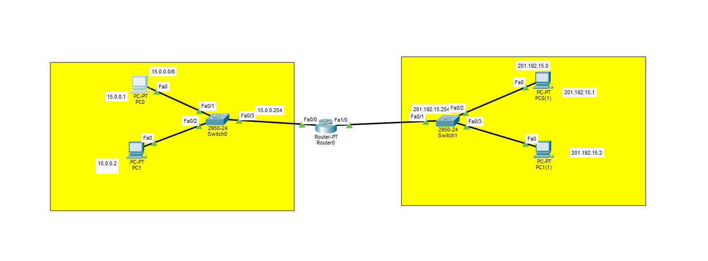

# 🖧 Simple Two-Network Routing Project (Cisco Packet Tracer)

This project demonstrates basic routing between two different LAN networks using a single router in Cisco Packet Tracer.

Two separate networks are connected through a router, and **PC IP addresses and default gateways are manually configured** to enable communication.

This is foundational networking — the kind you’re expected to know without blinking.

---

## 📷 Network Topology



---

## 📌 Project Overview

### Devices Used:

* 🖥️ 4 PCs
* 🔀 2 Switches (2950-24)
* 🌐 1 Router (R1)
* 🌍 2 Separate Networks

The router acts as the **default gateway** for both LANs and routes traffic between them.

---

# 🌐 IP Addressing Scheme

## 🔹 Network 1 (Left LAN)

* **Network:** `15.0.0.0/8`
* **Subnet Mask:** `255.0.0.0`
* **Gateway (Router Fa0/0):** `15.0.0.254`

| Device | IP Address | Subnet Mask | Default Gateway |
| ------ | ---------- | ----------- | --------------- |
| PC0    | 15.0.0.1   | 255.0.0.0   | 15.0.0.254      |
| PC1    | 15.0.0.2   | 255.0.0.0   | 15.0.0.254      |

---

## 🔹 Network 2 (Right LAN)

* **Network:** `201.192.15.0/24`
* **Subnet Mask:** `255.255.255.0`
* **Gateway (Router Fa1/0):** `201.192.15.254`

| Device | IP Address   | Subnet Mask   | Default Gateway |
| ------ | ------------ | ------------- | --------------- |
| PC0    | 201.192.15.1 | 255.255.255.0 | 201.192.15.254  |
| PC1    | 201.192.15.2 | 255.255.255.0 | 201.192.15.254  |

---

# 🖥️ Manual PC Configuration

Each PC was manually configured in **Desktop → IP Configuration** inside Packet Tracer.

For every PC:

1. Select **Static**
2. Enter:

   * IP Address
   * Subnet Mask
   * Default Gateway (Router interface IP)

⚠️ Without configuring the default gateway, PCs will not communicate with devices outside their local network.

That default gateway is what tells the PC:

> “If the destination isn’t in my subnet, send it to the router.”

No gateway = no inter-network communication.

---

# ⚙️ Router Configuration (R1)

```bash
enable
configure terminal

hostname R1

interface FastEthernet0/0
 description ##to sw1##
 ip address 15.0.0.254 255.0.0.0
 no shutdown

interface FastEthernet1/0
 ip address 201.192.15.254 255.255.255.0
 no shutdown

end
write memory
```

---

# 🔍 Verification

```bash
show ip interface brief
show running-config
```

Expected:

* FastEthernet0/0 → 15.0.0.254 (up/up)
* FastEthernet1/0 → 201.192.15.254 (up/up)

---

# 🧪 Connectivity Testing

From a PC:

```
ping 201.192.15.254
```

Successful output:

* 0% packet loss
* Replies received
* TTL = 255

You can also test:

* PC (15.0.0.x) → PC (201.192.15.x)
* PC (201.192.15.x) → PC (15.0.0.x)

If:

* IP address is correct
* Subnet mask is correct
* Default gateway is correct
* Router interfaces are up

Then routing works perfectly.

---

# 🧠 What This Lab is about

* Manual IP configuration
* Default gateway importance
* Basic router interface setup
* Understanding separate networks
* Layer 3 routing fundamentals
* CLI verification and troubleshooting

This is basic routing — and that’s exactly why it matters. If this doesn’t make sense, advanced routing protocols won’t either.

